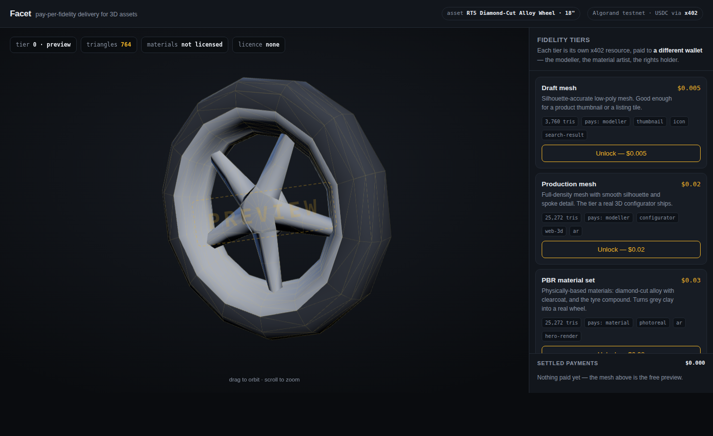
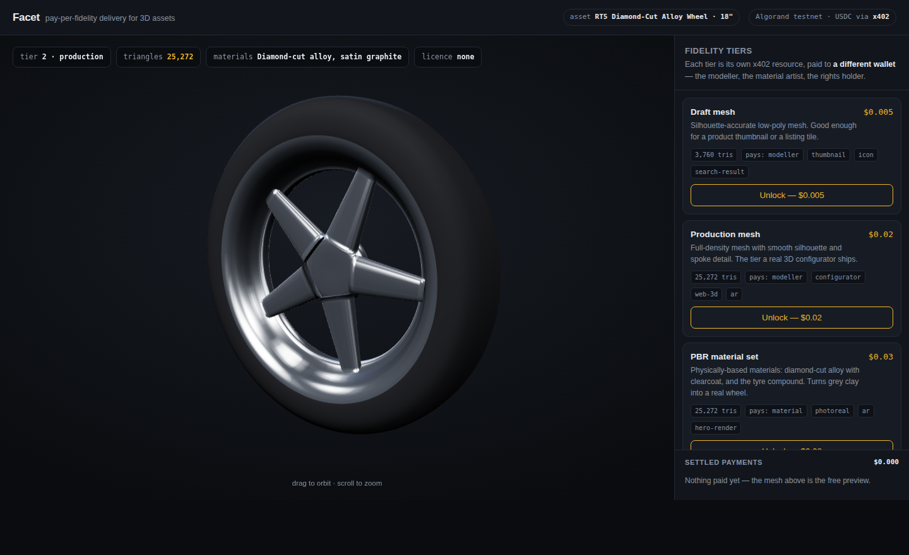
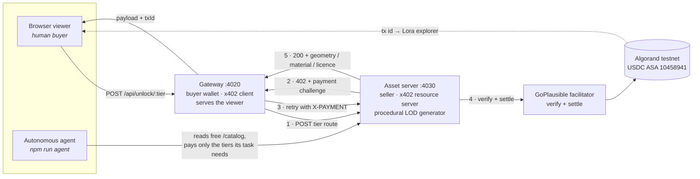

# Facet

**Pay-per-fidelity delivery for 3D assets — settled per request over x402 on Algorand.**

A 3D asset is not one product. It is a mesh, a material set, and a licence, and each of
those has a different cost to produce and a different value to the buyer. Facet sells them
separately, meters them by fidelity, and settles every request as a real micropayment on
Algorand testnet — so a thumbnail bot pays half a cent and a campaign render pays ten
cents, against exactly the same endpoints.

| Free preview — 764 triangles, wireframed | Unlocked — 25,272 triangles + PBR materials |
|---|---|
|  |  |

Same viewer, same session. Everything between those two images was paid for on chain.

---

## Table of contents

- [The problem](#the-problem)
- [The solution](#the-solution)
- [Features](#features)
- [Architecture](#architecture)
- [Flow of working](#flow-of-working)
- [The tiers](#the-tiers)
- [Setup guide](#setup-guide)
- [Testing and verification](#testing-and-verification)
- [Deploying](#deploying)
- [x402 transaction proof](#x402-transaction-proof)
- [USP — what is actually different](#usp--what-is-actually-different)
- [Known limitations](#known-limitations)
- [Scope of improvement](#scope-of-improvement)
- [Project structure](#project-structure)

---

## The problem

Every other digital medium got a metering layer. Text got paywalls and per-article
purchases. APIs got keys, quotas and usage billing. Images got licensing APIs, watermarks
and per-use rights. **3D never did.** Access to a 3D asset is still binary: either it is
public on a marketing site and anyone — including every AI crawler — takes the
full-quality file for nothing, or it is behind an enterprise contract that takes weeks and
a human signature.

That binary is now actively expensive, for two reasons.

**1. 3D is the one medium where value is natively tiered, and we charge one price anyway.**
A parts-catalogue thumbnail needs a few thousand triangles. A web configurator needs
twenty-five thousand. An AR "view it on my car" experience needs that mesh *plus* real
physically-based materials. A print campaign needs all of it plus redistribution rights.
Those are four genuinely different products with different production costs, and today
they are sold as one file at one price — which means most buyers overpay for fidelity they
throw away, and the ones who cannot afford the full price simply take the preview and
infringe.

**2. The buyer has stopped being a human.** AI agents are starting to assemble product
pages, generate synthetic training data, build AR experiences and render listings
autonomously. Every one of those tasks needs 3D assets. Not one of them can acquire one
legitimately, because every licensing path ever built assumes a person with a credit card
and a signature. So agents scrape instead — no payment, no licence, no attribution, and no
way for the studio that built the asset to even know it happened.

## The solution

Facet makes **fidelity the unit of sale** and **the HTTP request the unit of billing**.

Each tier of an asset is its own x402 resource with its own price. Ask for it without
paying and you get `402 Payment Required` with a signed challenge. Pay it and the tier
unlocks — for a human clicking a button in a browser, or for an autonomous agent that read
the public price list and worked out the cheapest tier that satisfies its task. Same
endpoints, same protocol, no API keys, no accounts, no contracts.

And because each tier is a separate payment, each can pay a **different party**. A 3D asset
has a supply chain — the modeller, the material artist, the rights holder — and today they
are paid once, up front, opaquely, no matter how many times the asset is used afterwards.
In Facet the mesh tiers pay the modeller's wallet, the material tier pays the material
artist's wallet, and the licence tier pays the rights holder's wallet, automatically, per
use, with the transactions public on chain.

---

## Features

**Fidelity-metered delivery**
- Four independently priced tiers per asset, each a separate x402 resource
- Geometry generated server-side at each triangle budget, so the client never holds
  fidelity it has not paid for
- A free, deliberately-degraded preview (764 triangles, wireframed and watermarked) that
  is useful for evaluation and useless for production

**Real on-chain settlement**
- Every unlock is a genuine Algorand testnet USDC payment through the GoPlausible
  facilitator — no mocks, no simulation
- Transaction id surfaced in the UI and in agent output, linking straight to Lora
- The settled transaction doubles as the licence receipt for the commercial tier

**Supply-chain payouts**
- Three distinct payee wallets — modeller, material artist, rights holder — each paid for
  their own contribution, per use
- Payee address is visible per tier in the public catalogue before you buy

**Agent-native by construction**
- A free `/catalog` endpoint that is a machine-readable price list, including what each
  tier is `suitableFor`
- A working autonomous buyer agent that reads the catalogue, reasons about the minimum
  fidelity its task requires, refuses to buy what it will not use, and pays
- No API keys, no accounts, no onboarding — an agent that has never spoken to the seller
  can transact on first contact

**Visible economics**
- The mesh visibly refines as each payment settles: faceted to smooth, grey clay to
  diamond-cut alloy with clearcoat and real environment reflections
- Live triangle counter, tier indicator, material and licence status
- Running ledger of settled payments with per-transaction explorer links

**Operationally sane**
- Facilitator preflight at boot, so an unreachable facilitator fails loudly with a remedy
  instead of surfacing as an opaque 500 on the first unlock
- `/health` on both services reporting facilitator reachability
- RFC 7807 Problem Details error bodies
- Structured JSON logging
- Zero build step — plain ESM JavaScript, `node src/...` and it runs
- Three.js served from `node_modules`, not a CDN, so venue wifi cannot break the viewer
- Docker and docker-compose included
- Two offline development aids: a stub facilitator, and a preview-tier override so you can
  iterate on the UI without spending testnet funds

---

## Architecture



**Why two services.** The seller has to be a separate process from the buyer for the
payment to be real — a service cannot meaningfully charge itself. The browser never holds
a private key: it asks the gateway to unlock a tier, and the gateway performs the actual
x402 payment with the buyer wallet. That is also what makes the deployed build a single
URL — the gateway serves both the viewer and the API on one port.

---

## Flow of working

### The x402 handshake, concretely

This runs on every single unlock:

```
1. Gateway  → Asset server : POST /asset/wheel-rt5/production        (no payment yet)
2. Asset s. → Gateway      : 402 Payment Required
                             PAYMENT-REQUIRED header, base64 JSON:
                             { scheme: "exact",
                               network: "algorand:SGO1GKSz…OiI=",   ← testnet genesis hash
                               amount: "20000",                      ← $0.02 in USDC micro-units
                               asset: "10458941",                    ← testnet USDC ASA
                               payTo: "<modeller wallet>" }
3. Gateway signs a payment for exactly that amount, to exactly that address, with the
   buyer wallet, and retries the identical request carrying an X-PAYMENT header.
4. Asset server hands that header to the GoPlausible facilitator, which verifies the
   signature and submits the real transaction to Algorand testnet.
5. Only after settlement does the route handler run for the first time. It returns 200
   with the payload, plus a payment-response header carrying the settled transaction id.
6. Gateway decodes that id and returns it to the caller alongside the payload.
```

Nothing before step 5 touches the geometry generator. The high-fidelity mesh is not
withheld by a flag in the response — it is never produced at all until money has moved.

### Human path

1. Browser loads the viewer from the gateway and calls `GET /api/catalog` (free) to render
   the tier cards, and `GET /api/preview` (free) to render the 764-triangle watermarked
   wireframe.
2. User clicks **Unlock — $0.02**. Browser calls `POST /api/unlock/production`.
3. Gateway runs the handshake above and returns the geometry plus the transaction id.
4. Viewer rebuilds the mesh from the new vertex data. Triangle counter jumps, watermark
   clears, silhouette smooths.
5. A row appears in the settled-payments ledger with a link to the transaction on Lora.
6. Unlocking **PBR** ships no new geometry at all — only the material description — and
   produces the single largest visual jump, because it is what turns grey clay into a real
   wheel. That is the clearest demonstration that fidelity, not bytes, is the product.
7. Unlocking **Commercial licence** returns a licence record whose proof is the settled
   transaction itself.

### Agent path

1. Agent is given a task, e.g. *"render a 512px product thumbnail for a parts-catalogue
   listing"*.
2. Agent calls `GET /catalog` — free, no payment, no key. It gets prices, triangle counts,
   payees and a `suitableFor` list for every tier.
3. Agent reasons about the minimum sufficient fidelity. For a 512px thumbnail only the
   silhouette survives, so it buys **draft** and explicitly declines production, PBR and
   licence.
4. Agent pays for exactly those tiers over x402 and prints a transaction id per payment.

Three tasks, same endpoints, three different amounts spent:

| Task | Buys | Spends |
|---|---|---|
| `thumbnail` | draft | $0.005 |
| `ar-tryon` | production + PBR | $0.050 |
| `campaign` | production + PBR + licence | $0.100 |

---

## The tiers

| Tier | Product | Price | Pays | What you actually get |
|---|---|---|---|---|
| 0 | Preview | free | — | 764 triangles, wireframed and watermarked |
| 1 | Draft mesh | $0.005 | modeller | 3,760 triangles — silhouette-accurate, enough for a thumbnail |
| 2 | Production mesh | $0.02 | modeller | 25,272 triangles — the density a real configurator ships |
| 3 | PBR material set | $0.03 | material artist | Diamond-cut alloy with clearcoat + tyre compound |
| 4 | Commercial licence | $0.05 | rights holder | Redistribution rights; **the settled transaction is the receipt** |

---

## Setup guide

### Prerequisites

- **Node.js 20 or newer** (`node --version`)
- Four Algorand **testnet** accounts
- Internet access to `facilitator.goplausible.xyz` and the Algorand testnet API

### 1. Install

```bash
git clone <your-repo-url>
cd facet
npm install
cp .env.example .env
```

### 2. Create wallets

```bash
npm run wallets
```

This prints four accounts in `.env`-ready form:

| Variable | Role | Needs funding? |
|---|---|---|
| `FACET_BUYER_PRIVATE_KEY` | pays for every unlock | **yes** — ALGO + testnet USDC |
| `FACET_MODELLER_ADDRESS` | receives mesh-tier payments | opt-in only |
| `FACET_MATERIAL_ADDRESS` | receives PBR-tier payments | opt-in only |
| `FACET_RIGHTS_ADDRESS` | receives licence-tier payments | opt-in only |

Paste them into `.env`. If you already have a funded testnet wallet from another project,
reuse it as the buyer — it saves the whole funding step.

### 3. Fund and opt in

- Fund the **buyer** with testnet ALGO: <https://bank.testnet.algorand.network>
- Fund the **buyer** with testnet USDC (ASA `10458941`)
- **Opt all three receiving accounts in to ASA `10458941`.** An Algorand account cannot
  receive an ASA it has not opted into, so payments to a non-opted-in payee will fail.

Budget generously — a full click-through of all four tiers costs $0.105, and you will run
it many times while rehearsing.

### 4. Run

```bash
npm run dev
```

That boots both services together with prefixed logs. Then open **<http://localhost:4020>**.

Individually, if you prefer separate terminals:

```bash
npm run start:asset-server   # :4030 — the seller
npm run start:gateway        # :4020 — the buyer + viewer
```

### 5. Confirm it is healthy

```bash
curl http://localhost:4030/health
# {"ok":true,"facilitator":"https://facilitator.goplausible.xyz","facilitatorReachable":true}
```

If `facilitatorReachable` is `false`, every paid tier will fail. Fix that before anything
else — the boot log names the reason and the remedy.

### Environment variables

| Variable | Default | Purpose |
|---|---|---|
| `FACET_BUYER_PRIVATE_KEY` | — | Buyer wallet: 25-word mnemonic or base64 secret key |
| `FACET_MODELLER_ADDRESS` | — | Payee for tiers 1 and 2 |
| `FACET_MATERIAL_ADDRESS` | — | Payee for tier 3 |
| `FACET_RIGHTS_ADDRESS` | — | Payee for tier 4 |
| `FACILITATOR_URL` | `https://facilitator.goplausible.xyz` | x402 facilitator |
| `ASSET_SERVER_URL` | `http://localhost:4030` | Where the gateway finds the seller |
| `ASSET_SERVER_PORT` | `4030` | Seller port |
| `PORT` | `4020` | Gateway port |
| `PREVIEW_TIER` | `0` | **Dev only.** Serve a paid tier from the free endpoint |
| `PREVIEW_MATERIAL` | unset | **Dev only.** Add PBR to the free preview |

---

## Testing and verification

```bash
# Free — this is how an agent discovers what is for sale
curl http://localhost:4030/catalog

# A paid tier without paying → 402 plus a signed challenge
curl -i -X POST http://localhost:4030/asset/wheel-rt5/production \
     -H "Content-Type: application/json" -d '{}'

# Decode the challenge to see amount, asset, network and payee
curl -si -X POST http://localhost:4030/asset/wheel-rt5/production \
     -H "Content-Type: application/json" -d '{}' \
  | grep -i '^payment-required' | sed 's/^[^:]*: //' | tr -d '\r' | base64 -d

# The autonomous agent — three tasks, three different amounts spent
npm run agent -- thumbnail
npm run agent -- ar-tryon
npm run agent -- campaign
```

Expected: all four paid routes return `402` unpaid, `/catalog` and `/asset/wheel-rt5/preview`
return `200`, and the decoded challenge shows `amount: "20000"`, `asset: "10458941"` and the
Algorand testnet genesis hash.

### Two offline development aids

`node scripts/stub-facilitator.js` answers the facilitator's `/supported` handshake
locally, so you can verify the shape of your 402 challenge with no network at all. It
cannot settle anything — real unlocks still need the real facilitator.

`PREVIEW_TIER=2 PREVIEW_MATERIAL=1` on the asset server makes the *free* endpoint serve
paid fidelity, so you can iterate on the viewer without spending testnet funds on every
reload. The server logs a loud warning when either is set. Never set them in a deployment.

---

## Deploying

The gateway serves the viewer and the API on one port, so the deployed product is a single
URL.

```bash
docker compose up --build
```

On a public VM, open only the gateway port (`4020`) and keep the asset server on the
internal Docker network. Both services read the same `.env`.

Two things to check after deploying, because they are the usual causes of a demo failing
in front of judges:

1. `curl http://<host>:4020/health` and `curl` the asset server's health from inside the
   network — confirm `facilitatorReachable: true` **from the deployed host**, not just from
   your laptop.
2. Run one real unlock against the deployed URL and click through to Lora. Network egress
   differs between your machine and a cloud VM; assume nothing.

---

## x402 transaction proof

> Replace this with a real transaction link before submitting.

Example settled payment on Algorand testnet:
`https://lora.algokit.io/testnet/transaction/<TXID>`

Every unlock in the UI renders its own Lora link, and `npm run agent` prints one per
payment, so any of them can be pasted here.

---

## USP — what is actually different

**Fidelity is the unit, not the file.** Every other x402 project meters requests. Facet
meters *quality* — which is only possible in a medium where quality is natively tiered, and
3D is that medium. The buyer pays for the fidelity their task consumes and nothing more.

**You can watch the payment work.** The asset visibly improves as each transaction settles.
The economics are not described in a diagram, they happen on screen.

**The asset's supply chain gets paid, not just its owner.** Three different wallets are
paid for three different contributions to the same asset, per use, automatically.

**The same endpoints serve humans and agents.** No separate developer API, no keys, no
onboarding. An agent that has never spoken to us reads the price list and buys what it
needs. That is the part that does not work at all today, and it is the reason x402 matters
for 3D specifically.

**The payment is the licence.** No PDF, no counter-signature, no rights-management
database — the settled Algorand transaction is the durable, publicly verifiable record that
this buyer acquired these rights at this moment.

---

## Known limitations

Stated plainly, because they are the honest boundary of what was built in a day.

- **The gateway spends its wallet for anyone who can reach it.** `POST /api/unlock/*`
  triggers a real payment with no authentication or spend cap. That is fine locally; on a
  public URL, anyone hitting the endpoint in a loop drains the buyer wallet. A per-session
  spend cap and rate limit is the first thing to add before exposing it publicly.
- **Entitlement is per-request, not persistent.** Paying for a tier does not record that
  you own it — reload the page and you pay again. There is no receipt lookup yet.
- **One asset.** The catalogue is a single procedurally generated wheel, not an ingestion
  pipeline for arbitrary uploaded models.
- **Geometry is procedural, not authored.** It is real generated geometry at genuinely
  different triangle budgets, but it is not a scanned or artist-made asset.
- **Payouts are separate transactions, not an atomic split.** Each tier pays one wallet.
  Splitting a single tier's revenue across several parties at once is not implemented.
- **No GLB/USDZ export.** The licence tier grants rights but hands back JSON vertex data
  rather than a file an AR viewer or DCC tool can open directly.
- **Testnet only.**

---

## Scope of improvement

### Near term — the obvious next build

- **Spend cap and rate limiting on the gateway**, so a public deployment cannot be drained.
- **Persistent entitlements.** Record settled transactions against the buyer's account and
  check that record before charging again, so ownership survives a reload. The chain
  already holds the proof; it just needs to be read back.
- **Real asset ingestion.** Accept an uploaded GLB and generate the tiers automatically
  with `meshoptimizer` / `gltf-transform` decimation, instead of one procedural model.
  This is what turns a demo into a product.
- **GLB and USDZ export on the licence tier**, so the thing you bought drops straight into
  a DCC tool, a game engine, or iOS Quick Look.

### Medium term — making it a marketplace

- **Multi-asset catalogue** with search and tags, so agents can discover assets rather than
  being handed one URL.
- **Register on the real x402 Bazaar** so any agent on the network can discover Facet
  assets globally, not just ones pointed at this server.
- **Atomic revenue splitting** using Algorand atomic transaction groups, so a single tier
  purchase can pay several contributors in one settled group rather than sequentially.
- **Creator analytics.** Which tiers sell, to whom, how often — the data a studio needs to
  price its own catalogue, which nobody has today because nobody meters 3D.
- **Progressive streaming.** Draco or meshopt compression and chunked delivery, so a tier
  upgrade streams in rather than replacing the mesh wholesale.

### Longer term — the interesting problems

- **Buyer-traceable watermarking.** Perturb the delivered mesh imperceptibly per buyer so a
  leaked asset traces back to the account that bought it. Enforcement is the hard part of
  any licensing system, and per-buyer delivery makes it tractable for the first time.
- **Provenance on the asset itself.** C2PA-style signed manifests attached to the delivered
  geometry, so a downstream consumer can verify the asset is authentic and correctly
  licensed rather than scraped.
- **An MCP server / agent SDK**, so an agent can call Facet as a native tool instead of
  hand-rolling HTTP and payment code.
- **Dynamic pricing.** Price tiers by demand, buyer type, or asset popularity — trivial to
  experiment with once every single use is a metered event.
- **Mainnet, with a fiat-pegged pricing oracle** so prices are quoted in currency rather
  than raw ASA units.

---

## Project structure

```
facet/
├── src/
│   ├── geometry.js       procedural LOD generator — the actual product
│   ├── asset-server.js   SELLER  :4030 — x402-gated tiers, catalogue, preview
│   ├── gateway.js        BUYER   :4020 — holds the wallet, pays, serves the viewer
│   └── agent-demo.js     autonomous buyer agent
├── public/
│   └── index.html        Three.js viewer, single file, no build step
├── scripts/
│   ├── dev.js               boots both services together
│   ├── generate-wallets.js  mints the four accounts
│   └── stub-facilitator.js  offline facilitator stand-in
├── docs/                 screenshots used above
├── Dockerfile
├── docker-compose.yml
└── .env.example
```

---

## Built with

`@x402/core` · `@x402/avm` · `@x402/express` · `@x402/fetch` · Algorand testnet USDC ·
GoPlausible facilitator · Express · Three.js (served from `node_modules`, no CDN) ·
plain ESM JavaScript, no build step.
