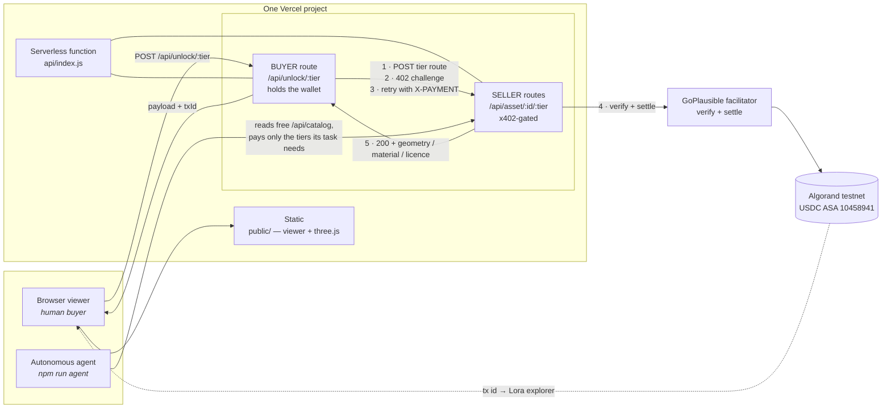

# Facet

**Pay-per-fidelity delivery for 3D assets — settled per request over x402 on Algorand.**

A 3D asset is not one product. It is a mesh, a material set, and a licence, and each of
those has a different cost to produce and a different value to the buyer. Facet sells them
separately, meters them by fidelity, and settles every request as a real micropayment on
Algorand testnet — so a thumbnail bot pays half a cent and a campaign render pays ten
cents, against exactly the same endpoints.

| Free preview — 662 triangles, wireframed | Unlocked — 2 triangles + PBR materials |
|---|---|
|  |  |

Same viewer, same session. Everything between those two images was paid for on chain.

**Live:** `https://facet-x402.vercel.app` · **Example transaction:** see [proof](#x402-transaction-proof)

---

## Table of contents

- [The problem](#the-problem)
- [The solution](#the-solution)
- [Features](#features)
- [Architecture](#architecture)
- [Flow of working](#flow-of-working)
- [The tiers](#the-tiers)
- [Setup guide](#setup-guide)
- [Deploying to Vercel](#deploying-to-vercel)
- [Testing and verification](#testing-and-verification)
- [x402 transaction proof](#x402-transaction-proof)
- [USP — what is actually different](#usp--what-is-actually-different)
- [Known limitations](#known-limitations)
- [Scope of improvement](#scope-of-improvement)
- [Project structure](#project-structure)

---

## The problem

Every other digital medium got a metering layer. Text got paywalls and per-article
purchases. APIs got keys, quotas and usage billing. Images got licensing APIs, watermarks
and per-use rights. **3D never did.** Access to a 3D asset is still binary: either it is
public on a marketing site and anyone — including every AI crawler — takes the
full-quality file for nothing, or it is behind an enterprise contract that takes weeks and
a human signature.

That binary is now actively expensive, for two reasons.

**1. 3D is the one medium where value is natively tiered, and we charge one price anyway.**
A parts-catalogue thumbnail needs a few thousand triangles. A web configurator needs
twenty-five thousand. An AR "view it on my car" experience needs that mesh *plus* real
physically-based materials. A print campaign needs all of it plus redistribution rights.
Those are four genuinely different products with different production costs, and today
they are sold as one file at one price — which means most buyers overpay for fidelity they
throw away, and the ones who cannot afford the full price simply take the preview and
infringe.

**2. The buyer has stopped being a human.** AI agents are starting to assemble product
pages, generate synthetic training data, build AR experiences and render listings
autonomously. Every one of those tasks needs 3D assets. Not one of them can acquire one
legitimately, because every licensing path ever built assumes a person with a credit card
and a signature. So agents scrape instead — no payment, no licence, no attribution, and no
way for the studio that built the asset to even know it happened.

## The solution

Facet makes **fidelity the unit of sale** and **the HTTP request the unit of billing**.

Each tier of an asset is its own x402 resource with its own price. Ask for it without
paying and you get `402 Payment Required` with a signed challenge. Pay it and the tier
unlocks — for a human clicking a button in a browser, or for an autonomous agent that read
the public price list and worked out the cheapest tier that satisfies its task. Same
endpoints, same protocol, no API keys, no accounts, no contracts.

And because each tier is a separate payment, each can pay a **different party**. A 3D asset
has a supply chain — the modeller, the material artist, the rights holder — and today they
are paid once, up front, opaquely, no matter how many times the asset is used afterwards.
In Facet the mesh tiers pay the modeller's wallet, the material tier pays the material
artist's wallet, and the licence tier pays the rights holder's wallet, automatically, per
use, with the transactions public on chain.

---

## Features

**Fidelity-metered delivery**
- Four independently priced tiers per asset, each a separate x402 resource
- Geometry generated server-side at each triangle budget, so the client never holds
  fidelity it has not paid for
- A free, deliberately-degraded preview (764 triangles, wireframed and watermarked) that
  is useful for evaluation and useless for production

**Real on-chain settlement**
- Every unlock is a genuine Algorand testnet USDC payment through the GoPlausible
  facilitator — no mocks, no simulation
- Transaction id surfaced in the UI and in agent output, linking straight to Lora
- The settled transaction doubles as the licence receipt for the commercial tier

**Supply-chain payouts**
- Three distinct payee wallets — modeller, material artist, rights holder — each paid for
  their own contribution, per use
- Payee address is visible per tier in the public catalogue before you buy

**Agent-native by construction**
- A free `/api/catalog` endpoint that is a machine-readable price list, including what each
  tier is `suitableFor`
- A working autonomous buyer agent that reads the catalogue, reasons about the minimum
  fidelity its task requires, refuses to buy what it will not use, and pays
- No API keys, no accounts, no onboarding — an agent that has never spoken to the seller
  can transact on first contact

**Visible economics**
- The mesh visibly refines as each payment settles: faceted to smooth, grey clay to
  diamond-cut alloy with clearcoat and real environment reflections
- Live triangle counter, tier indicator, material and licence status
- Running ledger of settled payments with per-transaction explorer links

**Deploys as one thing**
- A single Vercel project: static viewer plus one serverless function, no containers, no
  long-running processes, no separate frontend and backend hosts
- Zero build step — plain ESM JavaScript
- Three.js vendored into `public/`, so the viewer has no CDN dependency and cannot be
  broken by conference wifi
- Unlock rate limiting to slow down wallet drain on a public URL
- `/api/health` reports facilitator reachability and whether every wallet is configured
- RFC 7807 Problem Details error bodies, structured JSON logging
- Two offline development aids: a stub facilitator, and a preview-tier override so you can
  iterate on the UI without spending testnet funds

---

## Architecture



**Why buyer and seller are still separate.** A service cannot meaningfully charge itself,
so the payment has to cross a real network boundary. The buyer route makes a genuine
outbound HTTPS request to the seller's public URL and settles a real payment, exactly as an
unrelated third party would — the agent in `agent/demo.js` hits the identical endpoints
from outside the deployment and is indistinguishable to the seller. Packaging both roles
in one Vercel project is a deployment convenience, not a shortcut around the protocol.

**Why the browser never holds a key.** The buyer wallet lives only in server-side
environment variables. The browser asks the function to unlock a tier; the function pays.

---

## Flow of working

### The x402 handshake, concretely

This runs on every single unlock:

```
1. Buyer  → Seller : POST /api/asset/wheel-rt5/production        (no payment yet)
2. Seller → Buyer  : 402 Payment Required
                     PAYMENT-REQUIRED header, base64 JSON:
                     { scheme: "exact",
                       network: "algorand:SGO1GKSz…OiI=",   ← testnet genesis hash
                       amount: "20000",                      ← $0.02 in USDC micro-units
                       asset:  "10458941",                   ← testnet USDC ASA
                       payTo:  "<modeller wallet>" }
3. Buyer signs a payment for exactly that amount, to exactly that address, with the buyer
   wallet, and retries the identical request carrying an X-PAYMENT header.
4. Seller hands that header to the GoPlausible facilitator, which verifies the signature
   and submits the real transaction to Algorand testnet.
5. Only after settlement does the route handler run for the first time. It returns 200
   with the payload, plus a payment-response header carrying the settled transaction id.
6. Buyer decodes that id and returns it to the caller alongside the payload.
```

Nothing before step 5 touches the geometry generator. The high-fidelity mesh is not
withheld by a flag in the response — it is never produced at all until money has moved.

### Human path

1. Browser loads the static viewer, then calls `GET /api/catalog` (free) to render the tier
   cards and `GET /api/preview` (free) to render the 764-triangle watermarked wireframe.
2. User clicks **Unlock — $0.02**. Browser calls `POST /api/unlock/production`.
3. The function runs the handshake above and returns the geometry plus the transaction id.
4. Viewer rebuilds the mesh from the new vertex data. Triangle counter jumps, watermark
   clears, silhouette smooths.
5. A row appears in the settled-payments ledger linking to the transaction on Lora.
6. Unlocking **PBR** ships no new geometry at all — only the material description — and
   produces the single largest visual jump, because it is what turns grey clay into a real
   wheel. That is the clearest demonstration that fidelity, not bytes, is the product.
7. Unlocking **Commercial licence** returns a licence record whose proof is the settled
   transaction itself.
8. A **Download .glb** button appears as soon as any mesh tier is owned. It writes the
   geometry you paid for — plus the materials if you bought that tier — into a real binary
   glTF that opens in Blender, Unity or Unreal. If you bought the licence, the settling
   Algorand transaction is embedded inside the file's `asset.extras`, so the asset travels
   with its own proof of purchase instead of a PDF in someone's inbox. If you did not, the
   file records that it is unlicensed.

**Buying a cheaper tier never downgrades what you own.** Purchase the production mesh and
then the draft, and the viewer keeps showing the production mesh — the draft is recorded as
bought, but you keep the best thing you have paid for.

### Agent path

1. Agent is given a task, e.g. *"render a 512px product thumbnail for a parts-catalogue
   listing"*.
2. Agent calls `GET /api/catalog` — free, no payment, no key. It gets prices, triangle
   counts, payees and a `suitableFor` list for every tier.
3. Agent reasons about the minimum sufficient fidelity. For a 512px thumbnail only the
   silhouette survives, so it buys **draft** and explicitly declines production, PBR and
   licence.
4. Agent pays for exactly those tiers over x402 and prints a transaction id per payment.

Three tasks, same endpoints, three different amounts spent:

| Task | Buys | Spends |
|---|---|---|
| `thumbnail` | draft | $0.005 |
| `ar-tryon` | production + PBR | $0.050 |
| `campaign` | production + PBR + licence | $0.100 |

---

## The tiers

| Tier | Product | Price | Pays | What you actually get |
|---|---|---|---|---|
| 0 | Preview | free | — | 764 triangles, wireframed and watermarked |
| 1 | Draft mesh | $0.005 | modeller | 3,760 triangles — silhouette-accurate, enough for a thumbnail |
| 2 | Production mesh | $0.02 | modeller | 25,272 triangles — the density a real configurator ships |
| 3 | PBR material set | $0.03 | material artist | Diamond-cut alloy with clearcoat + tyre compound |
| 4 | Commercial licence | $0.05 | rights holder | Redistribution rights; **the settled transaction is the receipt** |

Facet wallet status — USDC ASA 10458941 on https://testnet-api.algonode.cloud


All four wallets are funded and opted in. Payments should work.


---

## Who sells, who buys, and what Facet cannot do

Worth being blunt about, because it is the first thing people get wrong.

**Facet cannot upgrade a model you downloaded from somewhere else.** If you have a
5,000-triangle free model, no service on earth can hand you the 500,000-triangle original
— that detail is not in the file. Anything claiming otherwise is inventing geometry, not
recovering it.

**The seller is the creator, and they ingest their own master.** A studio holds the
high-poly asset they built. They run it through Facet, which derives the tiers from it.
The free low-poly preview a buyer sees *is that studio's own degraded version* — the same
arrangement a stock marketplace already uses when it shows you a watermarked preview and
charges for the real file.

So the pipeline runs **master → tiers**, never the reverse. Facet's contribution is not
creating detail; it is rationing detail the seller already has, and making the upgrade a
half-cent HTTP request instead of a $79 checkout with an account, a cart and a licence PDF.

The practical consequence: **ingest your master, not a preview.** Feed it something
already decimated and every tier comes out near-identical, because there is nothing left
to ration. The ingester warns you when it detects this.

---

## Using your own 3D asset

Facet ships with a procedurally generated alloy wheel so a fresh clone works with no asset
file at all. To sell something else, ingest a binary glTF:

```bash
npm run ingest -- path/to/model.glb --name "Brake Caliper, 4-pot"
```

That reads the GLB, merges every triangle primitive in world space, normalises the model to
a consistent size, and generates the three mesh tiers by vertex-clustering decimation —
writing them to `assets/tiers.json`. Restart the server and it serves that asset instead.
Delete the file to go back to the wheel.

Tier budgets are **relative to your source**, not fixed numbers: roughly 3% for the free
preview, 15% for the draft, and **100% — your untouched master — for the production tier**.
That last one is the whole point. A buyer paying the top price receives exactly what you
ingested.

```
Ingesting caliper.glb
  source          182,441 triangles, 94,220 vertices
  tier 0              742 triangles (target 764)   61ms
  tier 1             3,905 triangles (target 3760)  44ms
  tier 2            24,880 triangles (target 25272) 39ms
  wrote           assets/tiers.json (1.1 MB)
```

Tiers are generated **ahead of time**, not per request, because a serverless function has
no writable disk and no budget to decimate a large mesh inside a request. If you want a
deployment to serve an ingested asset, commit `assets/tiers.json` — `.gitignore` excludes
it by default since it is a build artefact.

Notes:
- **`.glb` only.** A `.gltf` + `.bin` pair will not load; re-export as binary glTF.
- **Use a model with at least ~30k triangles**, and make it your master rather than a
  preview. Below that the tiers barely differ and the demonstration falls flat. The
  ingester warns you when it detects this.
- **Masters above ~70,000 triangles get capped.** Geometry-as-JSON costs about 39 bytes a
  triangle, so 70k is ~2.7 MB — the most that fits comfortably in a serverless response.
  Above that the top tier is a decimated version rather than your true master, and the
  ingester says so plainly. Fixing it properly needs mesh compression or chunked
  delivery, both on the roadmap.
- Materials, textures, animation and skinning are ignored — only geometry is read. An
  ingested asset is shaded with a single polished-metal PBR set at tier 3.
- Check the licence on anything you did not model yourself. The built-in wheel is
  generated from maths in `lib/geometry.js`, so it carries no third-party licence at all.

---

## Setup guide

### Prerequisites

- **Node.js 20 or newer** (`node --version`)
- Four Algorand **testnet** accounts
- Network access to `facilitator.goplausible.xyz` and the Algorand testnet API

### 1. Install

```bash
git clone https://github.com/Karthikeyan1508/facet-x402.git
cd facet-x402
npm install
cp .env.example .env
```

### 2. Create wallets

```bash
npm run wallets
```

This prints four accounts in `.env`-ready form:

| Variable | Role | Needs funding? |
|---|---|---|
| `FACET_BUYER_PRIVATE_KEY` | pays for every unlock | **yes** — ALGO + testnet USDC |
| `FACET_MODELLER_ADDRESS` | receives mesh-tier payments | opt-in only |
| `FACET_MATERIAL_ADDRESS` | receives PBR-tier payments | opt-in only |
| `FACET_RIGHTS_ADDRESS` | receives licence-tier payments | opt-in only |

Paste them into `.env`. If you already have a funded testnet wallet, reuse it as the buyer
and skip the funding step.

### 3. Fund and opt in

**The order matters:** ALGO → opt in → USDC. An account cannot receive USDC before it has
opted in, and cannot opt in without ALGO. This catches everyone once.

1. **Fund all four accounts with ALGO** at <https://lora.algokit.io/testnet/fund> (or
   <https://bank.testnet.algorand.network>) — 4 ALGO to the buyer, ~1 each to the three
   payees. `npm run wallets:status` prints every address, including unfunded ones.
2. **Opt every account in to USDC**, the buyer included:
   ```bash
   npm run optin
   ```
3. **Fund the buyer with USDC** — Lora's *Fund with USDC* section, or
   <https://faucet.circle.com> (choose Algorand testnet). Only the buyer needs it.
4. **Verify:**
   ```bash
   npm run wallets:status    # every row must say "opted in: yes"
   ```

A full click-through of all four tiers costs $0.105. Fund enough for a few dozen runs —
but see the warning under [Known limitations](#known-limitations) about *not*
over-funding the buyer on a public deployment.

> **New to Algorand?** [`PAYMENTS_SETUP.md`](PAYMENTS_SETUP.md) explains accounts, keys,
> ALGO vs USDC, minimum balances, opt-in, the full payment flow and a troubleshooting
> table. Written for teammates with no blockchain background.

### 4. Run locally

```bash
npm run dev
```

Open **<http://localhost:4020>**. The same Express app that runs here is what runs as the
serverless function on Vercel, so local and deployed behaviour match.

### 5. Confirm it is healthy

```bash
curl http://localhost:4020/api/health
```

```json
{
  "ok": true,
  "facilitatorReachable": true,
  "payeesConfigured": { "modeller": true, "material": true, "rights": true },
  "buyerConfigured": true
}
```

If `facilitatorReachable` is `false`, every paid tier will fail. Fix that before anything
else.

### Environment variables

| Variable | Default | Purpose |
|---|---|---|
| `FACET_BUYER_PRIVATE_KEY` | — | Buyer wallet: 25-word mnemonic or base64 secret key |
| `FACET_MODELLER_ADDRESS` | — | Payee for tiers 1 and 2 |
| `FACET_MATERIAL_ADDRESS` | — | Payee for tier 3 |
| `FACET_RIGHTS_ADDRESS` | — | Payee for tier 4 |
| `FACILITATOR_URL` | `https://facilitator.goplausible.xyz` | x402 facilitator |
| `MAX_UNLOCKS_PER_MINUTE` | `15` | Unlock throttle per warm instance |
| `ASSET_SERVER_URL` | this deployment's own origin | Only set if the seller lives elsewhere |
| `PORT` | `4020` | Local dev port; ignored by Vercel |
| `ALGOD_URL` | `https://testnet-api.algonode.cloud` | Algorand node, used by the wallet scripts only |
| `USDC_ASA_ID` | `10458941` | Testnet USDC asset id |
| `FACET_*_MNEMONIC` | — | Payee mnemonics — local only, used once by `npm run optin`. **Never add to Vercel.** |
| `PREVIEW_TIER` | `0` | **Dev only.** Serve a paid tier from the free endpoint |
| `PREVIEW_MATERIAL` | unset | **Dev only.** Add PBR to the free preview |

---

## Deploying to Vercel

There is nothing to containerise and no build step. Vercel serves `public/` statically and
runs `api/index.js` as a single serverless function; `vercel.json` rewrites every `/api/*`
request to it and raises the function timeout to 60s so on-chain settlement has room.

### Via the dashboard

1. Push this repo to GitHub.
2. On Vercel: **Add New → Project**, import the repo.
3. Framework preset: **Other**. Leave build command and output directory empty — there is
   no build.
4. Add the environment variables from your `.env` under **Settings → Environment
   Variables**, for the *Production* environment:
   - `FACET_BUYER_PRIVATE_KEY` (paste the 25-word mnemonic in quotes exactly as in `.env`)
   - `FACET_MODELLER_ADDRESS`
   - `FACET_MATERIAL_ADDRESS`
   - `FACET_RIGHTS_ADDRESS`
   - `FACILITATOR_URL` = `https://facilitator.goplausible.xyz`
5. Deploy.

### Via the CLI

```bash
npm i -g vercel
vercel login
vercel link
vercel env add FACET_BUYER_PRIVATE_KEY production
vercel env add FACET_MODELLER_ADDRESS production
vercel env add FACET_MATERIAL_ADDRESS production
vercel env add FACET_RIGHTS_ADDRESS production
vercel --prod
```

### Verify the deployment

Do this before telling anyone the link is live. Network egress from a Vercel function is
not the same as from your laptop, so assume nothing:

```bash
curl https://<your-app>.vercel.app/api/health          # facilitatorReachable must be true
curl https://<your-app>.vercel.app/api/catalog

curl -i -X POST https://<your-app>.vercel.app/api/asset/wheel-rt5/production \
     -H "Content-Type: application/json" -d '{}'       # must be 402
```

Then open the site and complete one real unlock end to end, and click through to Lora.

You can also point the agent at the deployment, which proves an outside party can transact
with no keys and no accounts:

```bash
FACET_URL=https://<your-app>.vercel.app npm run agent -- campaign
```

### Notes on serverless behaviour

- **Cold starts** re-run the facilitator handshake, so the first unlock after an idle
  period is a second or two slower. Warm it up before demoing by loading the page once.
- **`ASSET_SERVER_URL` is derived per request** from the incoming `x-forwarded-proto` and
  `host` headers, so the buyer always pays whichever origin served the request. Nothing to
  configure for preview deployments or custom domains.
- **Response size**: the largest payload (production mesh) is ~920 KB, well inside Vercel's
  limit.

---

## Testing and verification

```bash
# Free — this is how an agent discovers what is for sale
curl http://localhost:4020/api/catalog

# A paid tier without paying → 402 plus a signed challenge
curl -i -X POST http://localhost:4020/api/asset/wheel-rt5/production \
     -H "Content-Type: application/json" -d '{}'

# Decode the challenge to see amount, asset, network and payee
curl -si -X POST http://localhost:4020/api/asset/wheel-rt5/production \
     -H "Content-Type: application/json" -d '{}' \
  | grep -i '^payment-required' | sed 's/^[^:]*: //' | tr -d '\r' | base64 -d

# The autonomous agent — three tasks, three different amounts spent
npm run agent -- thumbnail
npm run agent -- ar-tryon
npm run agent -- campaign
```

Expected: all four paid routes return `402` unpaid, `/api/catalog` and `/api/preview`
return `200`, and the decoded challenge shows `amount: "20000"`, `asset: "10458941"` and
the Algorand testnet genesis hash.

### Two offline development aids

`npm run stub-facilitator` answers the facilitator's `/supported` handshake locally, so you
can verify the shape of your 402 challenge with no network at all. It cannot settle
anything — real unlocks still need the real facilitator.

`PREVIEW_TIER=2 PREVIEW_MATERIAL=1 npm run dev` makes the *free* endpoint serve paid
fidelity, so you can iterate on the viewer without spending testnet funds on every reload.
Never set these in a deployment.

---

## x402 transaction proof

> Replace this with a real transaction link before submitting.

Example settled payment on Algorand testnet:
`https://lora.algokit.io/testnet/transaction/<TXID>`

Every unlock in the UI renders its own Lora link, and `npm run agent` prints one per
payment, so any of them can be pasted here.

---

## USP — what is actually different

**Fidelity is the unit, not the file.** Every other x402 project meters requests. Facet
meters *quality* — which is only possible in a medium where quality is natively tiered, and
3D is that medium. The buyer pays for the fidelity their task consumes and nothing more.

**You can watch the payment work.** The asset visibly improves as each transaction settles.
The economics are not described in a diagram, they happen on screen.

**The asset's supply chain gets paid, not just its owner.** Three different wallets are
paid for three different contributions to the same asset, per use, automatically.

**The same endpoints serve humans and agents.** No separate developer API, no keys, no
onboarding. An agent that has never spoken to us reads the price list and buys what it
needs. That is the part that does not work at all today, and it is the reason x402 matters
for 3D specifically.

**The payment is the licence.** No PDF, no counter-signature, no rights-management
database — the settled Algorand transaction is the durable, publicly verifiable record that
this buyer acquired these rights at this moment.

---

## Known limitations

Stated plainly, because they are the honest boundary of what was built in a day.

- **The buyer wallet is spent by anyone who can reach the deployment.** `/api/unlock/*` is
  public and unauthenticated by design — that is what makes it agent-native — so the
  balance in the buyer wallet is the real spending cap. The rate limiter is a speed bump,
  not a guarantee, because each warm serverless instance counts separately.
  **Fund the buyer with a small amount, not your whole faucet balance.**
- **Entitlement is per-request, not persistent.** Paying for a tier does not record that
  you own it — reload the page and you pay again. There is no receipt lookup yet.
- **One asset at a time.** Ingestion replaces the catalogue's single asset rather than
  adding to it; there is no multi-asset catalogue yet.
- **Decimation is vertex clustering.** It genuinely reduces triangle counts and the tiers
  are visibly different, but quality is below a quadric-error decimator — thin features
  pick up jagged edges at the lowest tier.
- **Ingestion reads geometry only.** Materials, textures, animation and skinning in the
  source GLB are discarded.
- **Payouts are separate transactions, not an atomic split.** Each tier pays one wallet.
- **No USDZ export.** `.glb` download works; iOS Quick Look wants `.usdz`, which needs a
  separate converter.
- **Testnet only.**

---

## Scope of improvement

### Near term — the obvious next build

- **Persistent entitlements.** Record settled transactions against the buyer's account and
  check that record before charging again, so ownership survives a reload. The chain
  already holds the proof; it just needs to be read back. This also removes most of the
  wallet-drain exposure, because a repeat request stops costing anything.
- **Deliver masters of any size.** The top tier is capped at ~70k triangles by the
  serverless response limit. Draco or meshopt compression, or chunked delivery, would
  remove the ceiling — without which Facet cannot serve genuinely large production assets.
- **Better decimation.** Ingestion works (`npm run ingest`), but it uses vertex
  clustering — crude next to quadric error metrics, and it leaves visible jaggies on thin
  features. Swapping in `meshoptimizer` would improve tier quality substantially.
- **Upload through the UI**, so ingestion does not require shell access to the deployment.
- **GLB and USDZ export on the licence tier**, so the thing you bought drops straight into
  a DCC tool, a game engine, or iOS Quick Look.
- **Durable rate limiting** backed by Vercel KV or Upstash, so the throttle is global
  rather than per warm instance.

### Medium term — making it a marketplace

- **Multi-asset catalogue** with search and tags, so agents can discover assets rather than
  being handed one URL.
- **Register on the real x402 Bazaar** so any agent on the network can discover Facet
  assets globally, not just ones pointed at this deployment.
- **Atomic revenue splitting** using Algorand atomic transaction groups, so a single tier
  purchase can pay several contributors in one settled group rather than sequentially.
- **Creator analytics.** Which tiers sell, to whom, how often — the data a studio needs to
  price its own catalogue, which nobody has today because nobody meters 3D.
- **Progressive streaming.** Draco or meshopt compression and chunked delivery, so a tier
  upgrade streams in rather than replacing the mesh wholesale.

### Longer term — the interesting problems

- **Buyer-traceable watermarking.** Perturb the delivered mesh imperceptibly per buyer so a
  leaked asset traces back to the account that bought it. Enforcement is the hard part of
  any licensing system, and per-buyer delivery makes it tractable for the first time.
- **Provenance on the asset itself.** C2PA-style signed manifests attached to the delivered
  geometry, so a downstream consumer can verify the asset is authentic and correctly
  licensed rather than scraped.
- **An MCP server / agent SDK**, so an agent can call Facet as a native tool instead of
  hand-rolling HTTP and payment code.
- **Dynamic pricing.** Price tiers by demand, buyer type, or asset popularity — trivial to
  experiment with once every single use is a metered event.
- **Mainnet, with a fiat-pegged pricing oracle** so prices are quoted in currency rather
  than raw ASA units.

---

## Project structure

```
facet-x402/
├── api/
│   └── index.js          Vercel serverless entry — mounts the Express app
├── lib/
│   ├── app.js            the whole app: seller routes, buyer route, throttle
│   ├── catalogue.js      tier definitions, prices, payees — one source of truth
│   ├── asset.js          resolves ingested asset vs built-in procedural wheel
│   ├── geometry.js       procedural LOD generator — the built-in asset
│   ├── glb.js            binary glTF reader, no dependencies
│   └── decimate.js       vertex-clustering decimation to a triangle budget
├── public/
│   ├── index.html        Three.js viewer, single file, no build step
│   └── vendor/three/     three.js vendored, so there is no CDN dependency
├── agent/
│   └── demo.js           autonomous buyer agent
├── scripts/
│   ├── dev.js               local server running the same app
│   ├── generate-wallets.js  mints the four accounts
│   ├── ingest.js            .glb -> assets/tiers.json
│   ├── optin.js             opts every account in to USDC (one-time)
│   ├── wallets-status.js    balances + opt-in state for all four wallets
│   └── stub-facilitator.js  offline facilitator stand-in
├── docs/                 screenshots used above
├── vercel.json           /api/* rewrite + 60s function timeout
├── PAYMENTS_SETUP.md     Algorand + x402 guide for the team
└── .env.example
```

---

## Built with

`@x402/core` · `@x402/avm` · `@x402/express` · `@x402/fetch` · Algorand testnet USDC ·
GoPlausible facilitator · Express · Three.js (vendored, no CDN) · Vercel serverless ·
plain ESM JavaScript, no build step.
